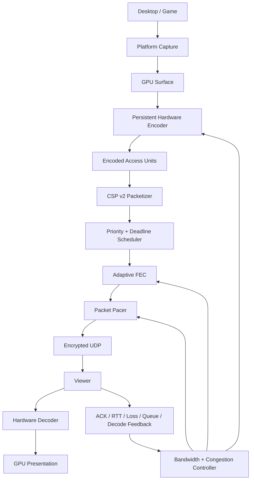

# Parsec-Style Screen Broadcast Roadmap

## Purpose

Stream Screen Protocol (CSP) should evolve into a native, ultra-low-latency screen-broadcast system optimized for one host and one or more viewers. The target is not a Twitch clone and not a remote-desktop product: there is no keyboard/mouse control channel. The product goal is high-quality desktop/game sharing with no artificial 1080p/FPS paywall and with latency closer to game-streaming software than conventional broadcast streaming.

This document is the architectural plan for CSP v2. It intentionally separates the target design from implementation so individual changes can be benchmarked and reviewed independently.

## Product goals

### Primary goals

- Native screen sharing for games, video, IDEs, browsers, terminals, and desktop applications.
- 1080p60 as a baseline rather than a premium mode.
- First-class 1080p120 and 1440p60/120 where hardware and network capacity allow it.
- 4K60 as a supported high-end target.
- Low glass-to-glass latency with graceful quality degradation under congestion.
- One host can serve multiple viewers without re-capturing or re-encoding the same frame per viewer.
- Direct peer-to-peer UDP when possible, relay fallback when direct traversal fails.
- Hardware capture, encode, decode, and presentation paths wherever possible.
- Cross-platform host/viewer architecture, with Windows and Linux as the first targets.
- No remote-control/input injection subsystem.

### Non-goals

- Competing with large-scale CDN broadcast distribution in the first CSP v2 release.
- Browser-only playback as the primary client.
- Perfect frame delivery at the expense of latency.
- Treating every lost packet as worth retransmitting.
- Software encoding as the preferred path for high-resolution/high-FPS streaming.

## Performance targets

Targets are end-to-end and should be measured rather than inferred from encoder/network timings.

| Profile | Resolution/FPS | Expected LAN target | Expected good-WAN target |
| --- | --- | --- | --- |
| Baseline | 1080p60 | <= 35 ms | <= 80 ms |
| High refresh | 1080p120 | <= 30 ms | <= 70 ms |
| High resolution | 1440p60 | <= 40 ms | <= 90 ms |
| High-end | 4K60 | <= 50 ms | <= 110 ms |

These are engineering targets, not guarantees. The runtime must expose capture, encode, network, decode, queue, and render timing separately so regressions can be identified.

## Architectural principles

1. **Capture once, encode once, fan out many times.** A viewer should add mostly network cost, not a second capture/encode pipeline.
2. **Frames have deadlines.** A late video packet is often less useful than a dropped packet.
3. **Audio is higher priority than video.** Video may reduce quality or drop stale frames before audio becomes unstable.
4. **Do not block new media behind old media.** Reliability must be selective and deadline-aware.
5. **Feedback controls both transport and encoder.** Congestion control that only sleeps between packets is insufficient.
6. **Avoid CPU copies.** GPU capture should feed a hardware encoder using native surfaces/textures when the platform allows it.
7. **Protocol behavior must be benchmarkable.** Every adaptation decision should be observable in metrics/logs.
8. **Build optional experimental paths behind capability negotiation.** AV1, FEC variants, QUIC/MoQ experiments, and hybrid desktop codecs should not break a stable H.264 baseline.

## Target pipeline



## Phase 0: establish a benchmark baseline

Before major transport work, create repeatable tests for the current implementation.

Metrics to capture:

- capture FPS and capture duration
- capture-to-encoder queue depth
- encode duration p50/p95/p99
- encoded frame size and bitrate
- packet count per frame
- pacing delay added per frame
- packet loss and burst-loss distribution
- NACK count and retransmitted bytes
- RTT/smoothed RTT/RTT variance
- jitter and receiver queue depth
- frame assembly wait time
- frames decoded, rendered, dropped, and late
- audio underruns and queue depth
- end-to-end frame latency when a common clock or marker-based measurement is available

A Docker/netem integration environment should be maintained separately from the production architecture work. It should support at least two simultaneous clients with different network conditions.

## Phase 1: persistent hardware encoding

### Current issue

A low-latency media pipeline cannot initialize a new external encoder process for each frame. Hardware encoder sessions must remain alive across frames.

### Minimum implementation

Replace per-frame process startup with a persistent encoder session. A temporary implementation may keep one FFmpeg/GStreamer process alive and stream raw frames through it, but this is only an intermediate step.

### Target implementation

Platform-native hardware backends:

- NVIDIA: NVENC SDK
- AMD Windows: AMF
- Intel: oneVPL / Quick Sync
- Linux: VAAPI where appropriate
- Linux NVIDIA: native NVENC path

The encoder abstraction should become session-oriented:

```go
type Encoder interface {
    Open(EncoderConfig) error
    Submit(FrameSurface, FrameMetadata) error
    Receive() (EncodedFrame, error)
    Reconfigure(RateControlUpdate) error
    RequestKeyframe()
    Close() error
}
```

The important change is that encoding is a long-lived pipeline and bitrate/QP can be updated without recreating the encoder.

## Phase 2: zero-copy capture-to-encode

### Windows

Preferred path:

```text
DXGI Desktop Duplication / Windows Graphics Capture
  -> ID3D11Texture2D
  -> encoder input surface
  -> encoded bitstream
```

Avoid converting the full frame to `[]byte` BGRA/RGBA on the CPU when the selected hardware encoder can accept a D3D surface.

### Linux

Preferred paths depend on the compositor/session:

- PipeWire + DMA-BUF for Wayland when available
- platform-specific X11 fallback
- import DMA-BUF into VAAPI/NVENC-compatible surfaces where supported

The capture API should expose a generic frame surface that may be CPU-backed or GPU-backed rather than requiring RGBA bytes.

```go
type FrameSurface interface {
    Width() int
    Height() int
    Format() PixelFormat
    Timestamp() time.Time
    NativeHandle() any
}
```

CPU-backed RGBA remains a compatibility fallback and test path.

## Phase 3: CSP v2 packet model

CSP v2 should keep the low-overhead UDP philosophy but add timing and stream semantics that the congestion/recovery layers can use.

### Packet header goals

Add or formalize:

- protocol version
- session ID
- stream ID (video/audio/cursor/control)
- frame/access-unit sequence
- packet sequence
- fragment index/count
- sender timestamp
- packet priority
- frame deadline or deadline class
- flags: keyframe, FEC, retransmission, end-of-frame

Do not place verbose metadata in every packet if it can be negotiated once at session setup.

### Streams

Recommended logical streams:

- `video-main`
- `audio-main`
- `cursor`
- `control-feedback`
- optional `video-region` / desktop enhancement stream

Control is transport/quality feedback only; it does not inject user input into the host.

## Phase 4: ACK/feedback and network measurement

The current feedback model should evolve from queue/drop pressure into explicit delivery measurements.

Each viewer should periodically report:

- highest received packet sequence
- selective ACK ranges or receive bitmap
- RTT samples
- receiver-estimated jitter
- packet loss over short and medium windows
- burst-loss length distribution
- receive bitrate / delivery rate
- frame assembly queue depth
- decoder queue depth
- frame drops due to lateness
- audio queue depth/underruns

The server should maintain per-viewer state. One weak viewer must not force all other viewers to use its packet pacing unless the host intentionally chooses a single shared encode profile.

## Phase 5: deadline-aware loss recovery

### Why plain retransmission is insufficient

At 120 FPS a frame interval is roughly 8.3 ms. Waiting tens or hundreds of milliseconds to recover a packet can make the recovered data useless.

For every lost packet, recovery should answer three questions:

1. Can FEC recover it without waiting for another RTT?
2. If not, is there enough time before the frame deadline for a retransmission to arrive?
3. If not, should the packet/frame be dropped and the decoder be repaired with a new reference/keyframe?

### Recovery policy

```text
loss detected
  -> FEC available? recover locally
  -> else deadline > estimated retransmit arrival? selective NACK
  -> else discard stale media
```

Keyframe/reference-frame packets may receive higher protection than disposable predicted-frame data.

## Phase 6: adaptive FEC

Introduce forward error correction as a first-class CSP layer rather than relying only on NACK.

Initial implementation should be simple and measurable, for example fixed-size XOR/reed-solomon groups. More advanced codes can be benchmarked later.

Example adaptive policy:

| Network state | Suggested redundancy |
| --- | --- |
| clean LAN | 0-2% |
| low random loss | 3-8% |
| moderate/bursty loss | 8-15% |
| unstable link | 15-25%, while also reducing bitrate |

The controller should avoid increasing FEC indefinitely when the real problem is congestion. If delivery rate is below send rate, bitrate must decrease.

## Phase 7: congestion control and packet pacing

A fixed packet-gap table should be replaced by a rate-based packet pacer driven by a bandwidth estimator.

### Inputs

- smoothed RTT and RTT trend
- RTT variance
- ACKed delivery rate
- short/long loss windows
- burst loss
- receiver media queues
- decoder drops
- NACK/recovery success

### Outputs

- target encoder bitrate
- packet pacing rate
- FEC percentage
- resolution tier
- FPS tier
- encoder QP/rate-control parameters
- keyframe request policy

The controller should react quickly to congestion but cautiously increase bitrate after recovery.

A possible first implementation can be inspired by GCC-style delay/loss feedback while keeping the wire format CSP-specific. Later experiments can compare BBR-like model-based control or SCReAM-style media congestion control.

## Phase 8: codec negotiation

Codec selection should be negotiated per viewer based on hardware encode/decode capability.

Preferred order when both sides support hardware acceleration:

1. AV1
2. HEVC/H.265
3. H.264

H.264 remains the mandatory compatibility baseline.

Capabilities should include:

- codec/profile/level
- 8-bit / 10-bit
- maximum resolution and FPS
- hardware decode availability
- HDR capability
- low-latency mode support

Avoid selecting a more efficient codec when it forces software decoding and increases total latency.

## Phase 9: codec settings for low latency

General low-latency recommendations:

- no B-frames by default
- short decoder queues
- repeat headers or out-of-band parameter-set handling that allows rapid recovery
- frequent enough intra refresh/keyframes to repair corruption without producing excessive bitrate spikes
- hardware rate control that can be changed at runtime
- avoid lookahead modes that add multiple frames of delay unless explicitly enabled for quality mode

Provide profiles such as:

- `latency`: lowest queues and fastest recovery
- `balanced`: default
- `quality`: larger quality-oriented encode budget with a bounded latency increase

## Phase 10: multi-viewer architecture

The server should maintain a viewer registry rather than a single destination address.

```go
type ViewerState struct {
    ID              ViewerID
    Addr            net.UDPAddr
    LastSeen        time.Time
    Capabilities    Capabilities
    Network         NetworkEstimate
    SelectedProfile StreamProfile
}
```

### Fan-out model

For viewers sharing the same selected encode profile:

```text
capture once
  -> encode once
  -> packetize once
  -> per-viewer pacing/recovery/fan-out
```

If viewers have radically different capabilities/bandwidth, the server may optionally run a small number of simulcast profiles later (for example high and low), but must not default to one encoder per viewer.

### Per-viewer feedback

NACK buffers, congestion estimates, last-seen timers, and requested repair state must be per viewer. A NACK from viewer A should retransmit only to viewer A.

## Phase 11: audio priority and synchronization

Keep Opus as the baseline audio codec.

Required improvements:

- authoritative media timestamps
- common session clock
- audio/video drift measurement
- bounded jitter buffer
- packet-loss concealment
- optional Opus in-band FEC
- audio packets scheduled above normal video packets

When bandwidth becomes constrained, video quality should fall before audio becomes unstable.

## Phase 12: separate cursor channel

For desktop sharing, cursor movement should not require video re-encoding.

Send:

- cursor image/hash when the cursor shape changes
- position updates at high frequency
- visibility state
- hotspot metadata

The viewer composites the cursor locally. `embedded` cursor remains available for compatibility/recording.

## Phase 13: content-adaptive desktop mode

The existing tile/delta concept can become a differentiating desktop mode rather than being removed.

Potential future architecture:

```text
base video stream
  + high-quality/lossless changed regions
  + independent cursor stream
```

This is useful for text-heavy content where conventional video compression can blur small fonts. It should remain experimental until measured against a well-tuned AV1/HEVC screen-content profile.

Possible signals:

- percentage of changed pixels
- motion vectors / temporal difference
- text/UI detection
- sustained static regions

Do not switch codecs rapidly frame-by-frame. Mode transitions need hysteresis.

## Phase 14: security and session establishment

Raw unauthenticated UDP should not be the production endpoint.

CSP v2 sessions should provide:

- authenticated handshake
- ephemeral session keys
- encrypted media/control packets
- replay protection
- viewer authorization tokens
- optional room/session IDs

The design should be compatible with P2P and relay modes.

## Phase 15: NAT traversal and relay fallback

Connection establishment should attempt:

```text
session signaling
  -> address discovery / STUN
  -> UDP hole punching / ICE-style candidate checks
  -> direct CSP UDP
  -> relay fallback if direct path fails
```

A relay should forward encrypted packets and should not need to decode/re-encode media.

Relay bandwidth is the primary scaling cost, so direct P2P should remain preferred for small private screen-sharing sessions.

## Phase 16: experimental QUIC / MoQ track

Do not replace CSP UDP solely because QUIC is newer. Maintain a benchmark track for:

- QUIC DATAGRAM
- WebTransport where browser interoperability becomes useful
- Media over QUIC / MOQT as the standards ecosystem matures

Promotion to production should require measurable benefits in NAT traversal, reliability control, implementation complexity, or relay operation without a latency/CPU regression.

## Scheduler design

CSP needs a media-aware scheduler rather than a single FIFO queue.

Suggested priority order:

1. session/control-critical packets
2. audio
3. keyframe/reference repair
4. cursor
5. current video frame
6. retransmissions that can still meet deadline
7. old/stale video: drop

This prevents old video retransmissions from delaying current audio/video.

## Queue policy

Every queue should be bounded.

If encoder output or network output cannot keep up:

- never grow an unbounded queue
- discard stale video frames
- preserve the newest decodable state
- signal the encoder to reduce bitrate/resolution/FPS
- request/produce repair frames when dropping breaks references

A stream that is five frames behind should prefer catching up over faithfully displaying all five late frames.

## Keyframe and reference repair strategy

Packet loss in predictive video can damage multiple subsequent frames. CSP should distinguish:

- keyframe data
- reference-frame data
- disposable frame data where codec/backend exposes this information

Possible repair mechanisms:

- immediate IDR request after unrecoverable reference loss
- intra refresh to avoid large bitrate spikes
- stronger FEC for key/reference frames
- parameter sets cached/repeated so a viewer can resume decoding quickly

## Rate adaptation ladder

A simple initial ladder can be used before fully continuous resolution adaptation.

Example:

```text
4K60
1440p120
1440p60
1080p120
1080p60
900p60
720p60
720p30
```

The controller should first adjust bitrate/QP within a tier, then step resolution/FPS down only when the current tier cannot be sustained. Upgrades should require a stable headroom window to prevent oscillation.

## Multi-viewer adaptation choices

Three modes should eventually be supported:

### Shared profile

All viewers receive the same encoded stream. Cheapest host GPU cost. Best default for small groups with similar bandwidth.

### Limited simulcast

Host generates 2-3 profiles (for example high/medium/low) and maps each viewer to one profile. Good future compromise.

### Per-viewer encode

Only an opt-in advanced mode. Highest GPU cost and should not be the default architecture.

## Observability

Expose a periodic stats snapshot on host and viewer.

Suggested host fields:

- capture_fps
- capture_ms
- encode_ms
- encoded_bitrate
- encoder_queue
- packets_sent
- retransmit_packets
- fec_overhead
- pacing_rate
- viewer_count
- per-viewer estimated_bandwidth
- per-viewer RTT/loss/jitter

Suggested viewer fields:

- receive_bitrate
- packet_loss
- recovered_by_fec
- recovered_by_nack
- unrecoverable_packets
- assembly_ms
- decode_ms
- render_queue_ms
- rendered_fps
- dropped_late_frames
- audio_buffer_ms

Support machine-readable JSON output so Docker/CI benchmarks can assert thresholds.

## Test matrix

Protocol changes should be validated against network profiles such as:

| Profile | Delay | Jitter | Loss | Notes |
| --- | --- | --- | --- | --- |
| LAN | 1 ms | 0.2 ms | 0% | baseline |
| Good WAN | 20 ms | 3 ms | 0.2% | normal remote use |
| Wi-Fi | 8 ms | 8 ms | 1% | jitter + random loss |
| Poor WAN | 60 ms | 15 ms | 2% | adaptation stress |
| Bursty | 25 ms | 5 ms | burst model | FEC/recovery stress |
| Asymmetric | different uplink/downlink | variable | variable | feedback path stress |

At least two viewers should be tested simultaneously with different profiles to catch accidental global congestion state.

## Proposed implementation sequence

### Milestone A: remove avoidable pipeline latency

- [ ] Persistent H.264 hardware encoder session
- [ ] Persistent hardware decoder session
- [ ] accurate capture/encode/decode timestamps
- [ ] benchmark current copy counts and CPU usage

**Exit criterion:** stable 1080p60 encoding without per-frame process creation; latency components visible in stats.

### Milestone B: GPU-native pipeline

- [ ] generic GPU/CPU frame-surface abstraction
- [ ] Windows DXGI -> D3D11 -> NVENC/AMF path
- [ ] Linux PipeWire/DMA-BUF path where supported
- [ ] copy/fallback path retained

**Exit criterion:** hardware-supported hosts avoid full-frame GPU->CPU->GPU round trips.

### Milestone C: CSP v2 transport foundation

- [ ] session/viewer IDs
- [ ] global packet sequence + media timestamps
- [ ] ACK ranges/receive feedback
- [ ] RTT/loss/jitter/delivery-rate estimator
- [ ] bounded media queues
- [ ] rate-based packet pacer

**Exit criterion:** server can explain why it selected its current sending rate.

### Milestone D: resilient low-latency delivery

- [ ] packet deadlines
- [ ] selective deadline-aware retransmission
- [ ] initial FEC implementation
- [ ] adaptive FEC controller
- [ ] keyframe/reference repair

**Exit criterion:** under controlled packet loss, latency remains bounded and recovery does not create a retransmission backlog.

### Milestone E: adaptive encoder

- [ ] runtime bitrate reconfiguration
- [ ] adaptation ladder
- [ ] AV1/HEVC negotiation
- [ ] dynamic FPS/resolution changes

**Exit criterion:** stream automatically converges to a sustainable profile in Docker/netem tests.

### Milestone F: multi-viewer

- [ ] viewer registry
- [ ] per-viewer feedback/recovery/pacing
- [ ] encode-once fan-out for shared profile
- [ ] optional limited simulcast design

**Exit criterion:** two viewers with different network conditions can remain connected simultaneously without the weaker path destroying the healthy path.

### Milestone G: Internet-ready session layer

- [ ] authenticated encryption
- [ ] signaling/session token
- [ ] STUN/candidate discovery
- [ ] direct-path negotiation
- [ ] relay fallback

**Exit criterion:** users behind common NATs can connect without manual port forwarding, with media encrypted end-to-end where relay mode is used.

### Milestone H: CSP differentiation

- [ ] independent cursor channel
- [ ] screen-content tuned codec presets
- [ ] experimental hybrid tile/region enhancement
- [ ] HDR/10-bit capability negotiation
- [ ] QUIC/MoQ benchmark track

## PR sizing guidance

Avoid implementing an entire milestone in one PR. Good review units are examples such as:

- persistent FFmpeg encoder session only
- packet timestamp/sequence schema only
- ACK feedback wire format + tests
- bandwidth estimator with synthetic tests
- packet pacer with deterministic unit tests
- XOR/Reed-Solomon FEC prototype behind a feature flag
- viewer registry without adaptation changes
- Docker/netem harness independently from protocol behavior changes

Each transport PR should include before/after benchmark data when possible.

## Definition of success

CSP v2 is successful when it can demonstrate all of the following in repeatable tests:

- 1080p60 is a normal baseline, not a gated feature.
- high-refresh streaming works when hardware/network permit it.
- adding packet loss does not cause unbounded latency growth.
- stale video is dropped instead of accumulating.
- audio remains stable when video bandwidth is reduced.
- two viewers with different network quality remain independently adapted.
- hardware-supported paths avoid unnecessary CPU frame copies.
- a viewer can recover rapidly after temporary loss.
- direct P2P works where possible and relay fallback is available where not.
- metrics make regressions diagnosable rather than subjective.

The most important early work is not adding more codecs. It is eliminating per-frame encoder startup/copies and turning CSP into a deadline-aware, measurable media transport whose encoder and network controller adapt together.
