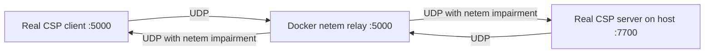

# Docker netem relay lab

This lab is for testing the **real CSP server and real CSP client on your machine** while Docker sits in the middle as a network emulator.

Runtime topology:



Docker does **not** run the CSP server or CSP client in normal use. It only forwards UDP and applies Linux `tc netem` so the packets experience configured delay, jitter, loss, duplication, or rate limiting.

## Quick local test

Open three terminals from the repository root.

### 1. Start the real CSP server

```bash
make netem-server
```

The normal `server.config.json` binds the server to `0.0.0.0:7700` so the Docker container reaches it through `host.docker.internal`.

### 2. Start the Docker relay

```bash
make netem-up
```

By default this starts the relay with the **Standard Wi-Fi** preset (`20ms ± 2ms, 0.5% loss`).

To choose another preset, specify `NETEM_PRESET`:

```bash
NETEM_PRESET=mobile make netem-up
```

### 3. Start the real client

```bash
make netem-client
```

This runs the client binary from `tests/netem/client`, whose `client.config.json` points at `127.0.0.1:5000`.

## Built-in Presets

| Preset | `NETEM_PRESET` Value | Delay & Jitter | Packet Loss | Rate Limit | Simulated Condition |
|---|---|---|---|---|---|
| **LAN / Transparent** | `lan` | 0 ms | 0% | Unlimited | Perfect connection / direct LAN |
| **Fast Broadband** | `broadband` | 10 ms ± 1 ms | 0.1% | Unlimited | Low-latency fiber or high-speed broadband |
| **Standard Wi-Fi** *(Default)* | `wifi` | 20 ms ± 2 ms | 0.5% | Unlimited | Typical residential Wi-Fi |
| **Mobile 4G/5G** | `mobile` | 80 ms ± 15 ms | 3.0% | Unlimited | Cellular mobile data |
| **Degraded / Bad Network** | `bad` | 150 ms ± 30 ms | 8.0% | Unlimited | Poor reception, congested Wi-Fi / LTE |
| **Extreme Stress Test** | `extreme` | 250 ms ± 50 ms | 15.0% | 10 Mbps | Severe packet loss, jitter & bandwidth constraint |
| **Custom Variables** | `custom` | *from env* | *from env* | *from env* | Custom variables defined below |

### Example Preset Commands

```bash
# Run with mobile connection simulation:
NETEM_PRESET=mobile make netem-up

# Run with severe loss & delay:
NETEM_PRESET=bad make netem-up

# Run with extreme stress test:
NETEM_PRESET=extreme make netem-up
```

## Custom Environment Settings

To configure custom network parameters, set `NETEM_PRESET=custom`:

```bash
NETEM_PRESET=custom \
NETEM_DELAY=100ms \
NETEM_JITTER=15ms \
NETEM_LOSS=8% \
make netem-up
```

Available environment variables:

| Variable | Default | Description |
| --- | --- | --- |
| `NETEM_PRESET` | `wifi` | Built-in preset (`wifi`, `lan`, `broadband`, `mobile`, `bad`, `extreme`, `custom`) |
| `TARGET_ADDR` | `host.docker.internal:7700` | Target server address |
| `RELAY_PORT` | `5000` | Host UDP port mapped to relay |
| `NETEM_DELAY` | `20ms` | Network latency |
| `NETEM_JITTER` | `2ms` | Latency jitter |
| `NETEM_LOSS` | `0.5%` | Packet loss percentage |
| `NETEM_DUPLICATE` | `0%` | Packet duplication percentage |
| `NETEM_RATE` | unlimited | Bandwidth rate limit (e.g. `10mbit`) |
| `IDLE_TIMEOUT` | `2m` | Client session idle timeout |

## Inspect and stop

Follow relay logs:

```bash
make netem-logs
```

Stop the relay container:

```bash
make netem-down
```

## Relay implementation smoke test

For CI and `make test-netem`, `compose.smoke.yml` sets `NETEM_PRESET=custom` and adds a UDP echo target to test the relay pipeline non-interactively.

```bash
make test-netem
```
