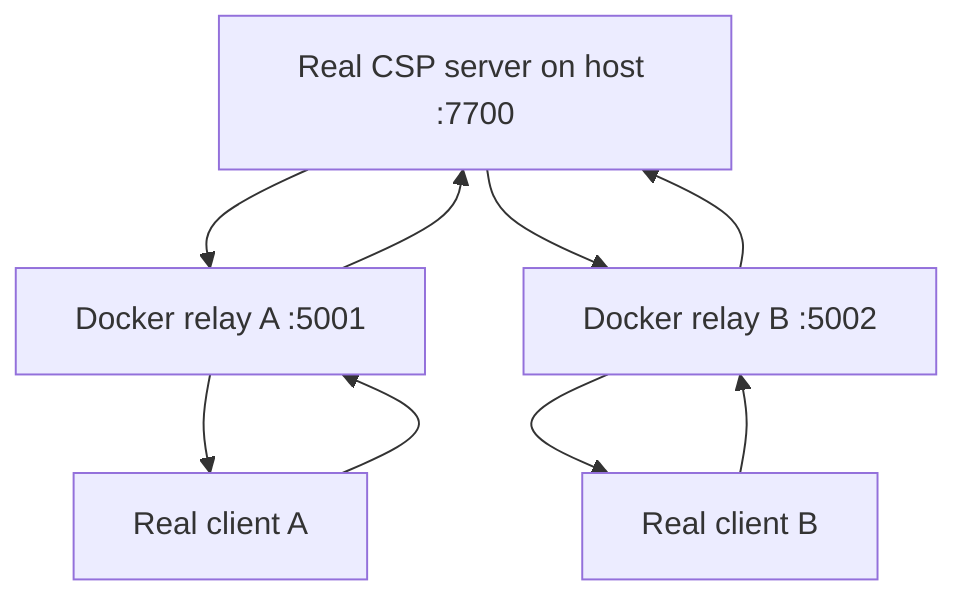
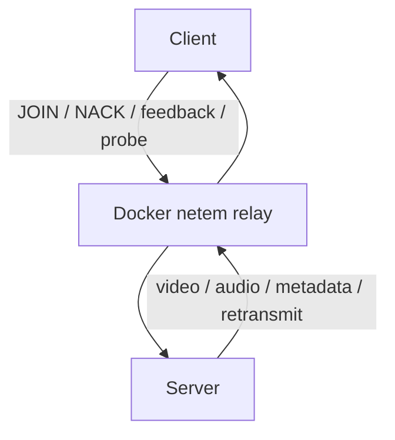

# Docker netem relay lab

This lab is for testing the **real CSP server and real CSP clients on your machine** while Docker sits only in the middle as a network emulator.

Runtime topology:



Docker does **not** run the CSP server or CSP client in normal use. It only forwards UDP and applies Linux `tc netem` so the packets experience configured delay, jitter, loss, duplication, or rate limiting.

## Quick local test

Open four terminals from the repository root.

### 1. Start the real CSP server

```bash
make netem-server
```

The normal `server.config.json` should bind the server to `0.0.0.0:7700` so the Docker containers can reach it through `host.docker.internal`.

### 2. Start both Docker relays

```bash
make netem-up
```

By default this creates:

```text
127.0.0.1:5001 -> relay A -> host.docker.internal:7700
127.0.0.1:5002 -> relay B -> host.docker.internal:7700
```

Default profiles:

| Path | Delay | Jitter | Loss |
| --- | ---: | ---: | ---: |
| relay A / client A | 20 ms | 2 ms | 0.5% |
| relay B / client B | 100 ms | 15 ms | 8% |

### 3. Start real client A

```bash
make netem-client-a
```

This runs the normal client binary from `tests/netem/client-a`, whose `client.config.json` points at `127.0.0.1:5001`.

### 4. Start real client B

```bash
make netem-client-b
```

This runs the same normal client binary from `tests/netem/client-b`, whose config points at `127.0.0.1:5002`.

You now have the same real server stream going through two different simulated network paths at the same time.

## What is actually impaired?

The relay is bidirectional. Both directions pass through the container:



That means the test affects CSP media and the feedback/recovery traffic used by congestion control, FEC, NACK, RTT probes, and retransmission logic.

`tc netem` is attached to the relay container egress interface, so a round trip crosses the configured impairment once in each direction.

## Change the network profiles

All runtime settings can be overridden with environment variables:

```bash
RELAY_A_DELAY=5ms \
RELAY_A_JITTER=1ms \
RELAY_A_LOSS=0.1% \
RELAY_B_DELAY=150ms \
RELAY_B_JITTER=30ms \
RELAY_B_LOSS=12% \
make netem-up
```

Available settings:

| Variable | Default |
| --- | --- |
| `TARGET_ADDR` | `host.docker.internal:7700` |
| `RELAY_A_PORT` | `5001` |
| `RELAY_B_PORT` | `5002` |
| `RELAY_A_DELAY` | `20ms` |
| `RELAY_A_JITTER` | `2ms` |
| `RELAY_A_LOSS` | `0.5%` |
| `RELAY_A_DUPLICATE` | `0%` |
| `RELAY_A_RATE` | unlimited |
| `RELAY_B_DELAY` | `100ms` |
| `RELAY_B_JITTER` | `15ms` |
| `RELAY_B_LOSS` | `8%` |
| `RELAY_B_DUPLICATE` | `0%` |
| `RELAY_B_RATE` | unlimited |
| `IDLE_TIMEOUT` | `2m` |

For example, to test against another CSP server on your LAN:

```bash
TARGET_ADDR=192.168.1.50:7700 make netem-up
```

## Inspect and stop

Follow relay logs:

```bash
make netem-logs
```

Stop the relay containers:

```bash
make netem-down
```

## Relay implementation smoke test

The normal runtime Compose file contains only relay A and relay B.

For CI and `make test-netem`, `compose.smoke.yml` adds a tiny **CI-only UDP echo target**. It exists only to verify that host packets really traverse the published Docker port, relay, `tc netem`, target, and return path. It is not used when testing CSP locally.

```bash
make test-netem
```

The stable CI profiles use relay A at `10ms / 0% loss` and relay B at `100ms / 12% loss`, then assert that relay B has materially higher RTT and packet loss.

## Relationship to PR #1

This PR is stacked on PR #1 because the two-client local test is intended to exercise PR #1's multi-viewer server, per-viewer congestion/recovery state, FEC, and deadline-aware transport under two different network conditions.
